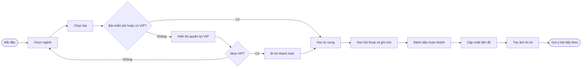
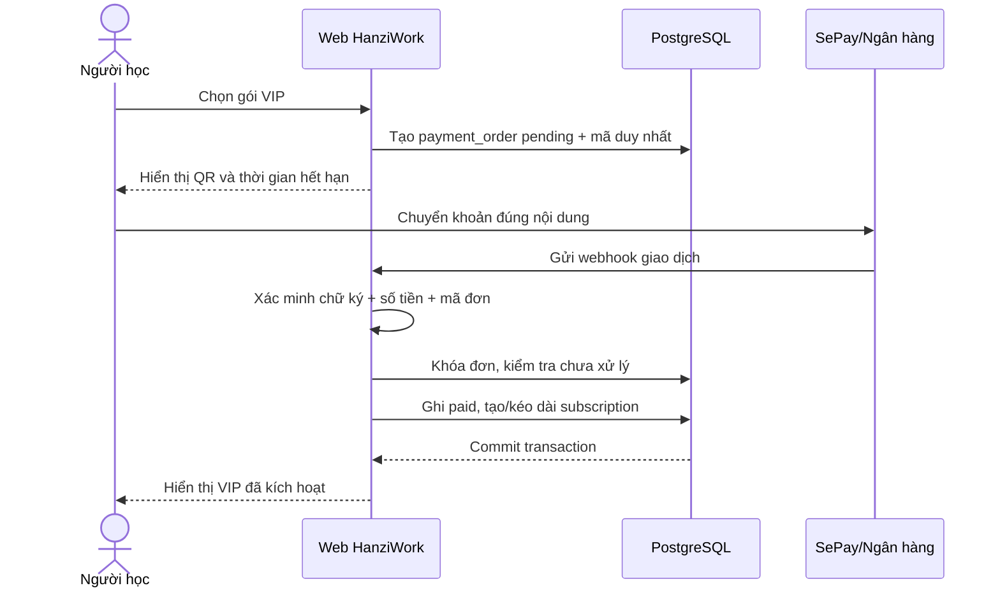
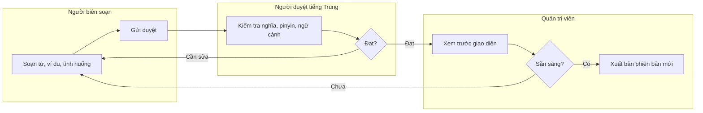
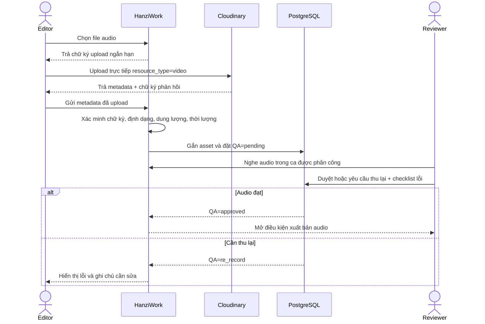

# Quy trình nghiệp vụ (BPMN-ready)

Các sơ đồ dưới đây là đặc tả luồng để chuyển sang BPMN 2.0 khi đội phát triển cần mô hình hóa bằng Camunda Modeler hoặc bpmn.io.

## 1. Luồng học

Quy tắc: quyền xem bài phải được xác nhận ở server. Khi hoàn thành, cập nhật `lesson_progress` và tạo/cập nhật `review_items` trong cùng một transaction.

## 2. Mua và kích hoạt VIP qua SePay

Trường hợp ngoại lệ cần vào `manual_review`: sai số tiền, thiếu mã đơn, webhook trùng, đơn hết hạn hoặc giao dịch đã gắn với đơn khác. Tuyệt đối không kích hoạt chỉ dựa trên ảnh chụp chuyển khoản.

## 3. Biên soạn và xuất bản nội dung

Với Luyện ca, khi Editor gửi `draft → review`, hệ thống ghi thời điểm gửi và đưa ca vào hàng đợi. Admin gán reviewer đang hoạt động, mức ưu tiên và hạn duyệt; Reviewer cũng có thể tự nhận ca chưa phân công nhưng không thể lấy ca đang thuộc người khác. Reviewer chỉ được trả ca hoặc xuất bản sau khi đã nhận ca đó. Khi ca rời trạng thái `review`, hạn duyệt được đóng lại; mọi lần gán, nhận, bỏ nhận và chuyển trạng thái đều được ghi vào `audit_logs`.

### 3.1. Tải lên và duyệt audio Luyện ca

Quy tắc vận hành:

- `CLOUDINARY_API_SECRET` chỉ tồn tại phía server thông qua `CLOUDINARY_URL`; trình duyệt chỉ nhận chữ ký upload có thời hạn.
- Audio được gửi thẳng từ trình duyệt lên Cloudinary để không truyền file lớn qua server HanziWork. Cloudinary xử lý audio dưới `resource_type=video`.
- Route phát audio vẫn kiểm tra ca đã xuất bản và quyền miễn phí/VIP ở server; nếu asset nằm trên Cloudinary thì route trả redirect tạm thời sang CDN.
- Thay file hoặc thay transcript luôn đặt QA về `pending`. Học viên chỉ nhận audio `approved`; checklist xuất bản yêu cầu toàn bộ lượt nghe đã được duyệt.
- Asset PostgreSQL cũ vẫn hoạt động trong thời gian chuyển đổi. Sau khi có `CLOUDINARY_URL`, chạy `npm run practice:audio:migrate-cloudinary`; chỉ khi upload và ghi metadata thành công script mới xóa blob cũ khỏi PostgreSQL.

Mỗi lần xuất bản tạo một snapshot nội dung (`content_versions` hoặc `practice_scenario_versions`). Mọi thay đổi quyền, VIP, giá và hoàn tiền được ghi vào `audit_logs`.
