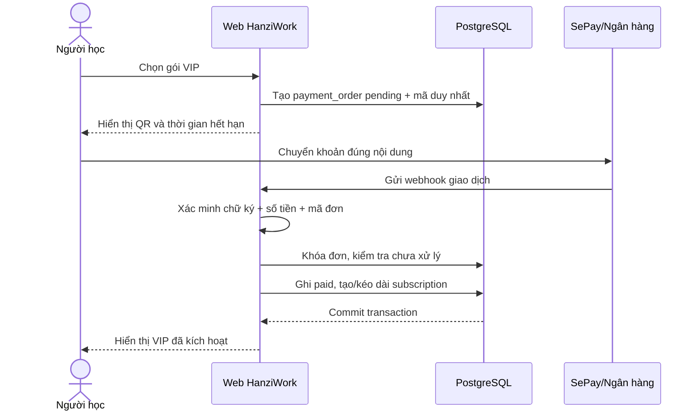
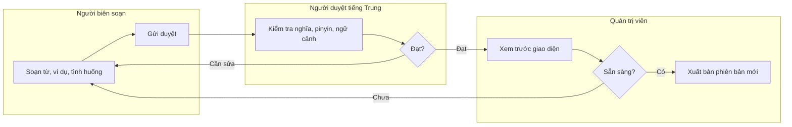

# Quy trình nghiệp vụ (BPMN-ready)

Các sơ đồ dưới đây là đặc tả luồng để chuyển sang BPMN 2.0 khi đội phát triển cần mô hình hóa bằng Camunda Modeler hoặc bpmn.io.

## 1. Luồng học

Quy tắc: quyền xem bài phải được xác nhận ở server. Khi hoàn thành, cập nhật `lesson_progress` và tạo/cập nhật `review_items` trong cùng một transaction.

## 2. Mua và kích hoạt VIP qua SePay

Trường hợp ngoại lệ cần vào `manual_review`: sai số tiền, thiếu mã đơn, webhook trùng, đơn hết hạn hoặc giao dịch đã gắn với đơn khác. Tuyệt đối không kích hoạt chỉ dựa trên ảnh chụp chuyển khoản.

## 3. Biên soạn và xuất bản nội dung

Mỗi lần xuất bản tạo một `content_versions` snapshot. Mọi thay đổi quyền, VIP, giá và hoàn tiền được ghi vào `audit_logs`.
